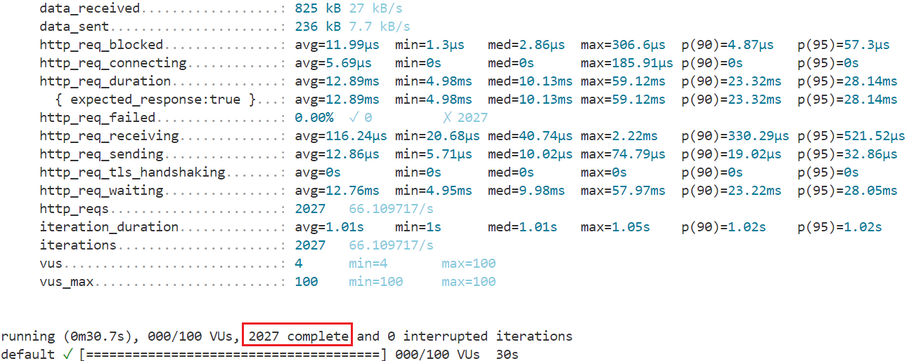
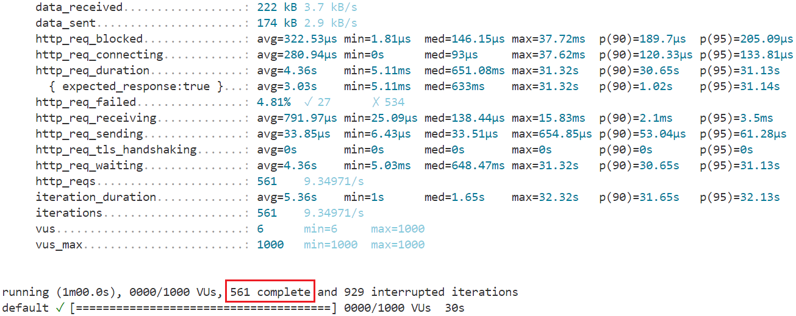

# k6压力测试代码
```
# stress_testing_in_k6.js
import http from 'k6/http';
import { sleep } from 'k6';

export const options = {
  // Key configurations for Stress in this section
  stages: [
    { duration: '10s', target: 100 }, // traffic ramp-up from 1 to a higher 200 users over 10 minutes.
    { duration: '10s', target: 100 }, // stay at higher 200 users for 30 minutes
    { duration: '10s', target: 0 }, // ramp-down to 0 users
  ],
};

export default () => {
  const urlRes = http.get(`http://localhost:5001/users/?VU=${__VU}&ITER=${__ITER}&skip=0&limit=100`);
  sleep(1);
};
```
使用命令`k6 run stress_testing_in_k6.js`运行压测代码。

# 结果
## 100个虚拟用户的结果

**系统无异常。**
## 1000个虚拟用户的结果

**系统崩溃。**

# 分析
100个虚拟用户完成的请求数为**2027**，1000个虚拟用户完成的请求数却仅为**561**。推测是在FastAPI的事件循环中发生了不必要的阻塞。